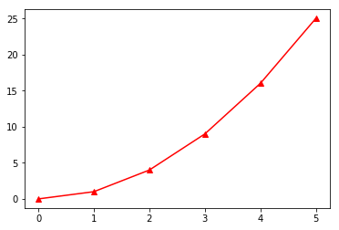

#　NumPy基础


## 1.0 NumPy简介

NumPy, 是Numerical Python的简称，高性能科学计算和数据分析的基础包．是其他高级工具包的基础．其功能如下：

1. ndarray，又称NumPy数组，或数组．
2. 对整组数据进行快速运算的标准数学函数
3. 用于集成其它语言(C,C++, Fortran)编写的代码的工具
4. 用于读写磁盘数据的工具，用于操作内存映射文件的工具
5. 线性代数，随机数生成，FT


**NumPy的特点**：　面向数组的计算．

**重要思想**：　面向数组的编程和面向数组地思考．有了数组，我们**不用编写循环**，也能对数据做批量运算．


### 1.1 NumPy的导入

```python
# 标准的NumPy约定
import numpy as np

# 另外，标准的matplotlib.pyplot导入约定
import matplotlib.pyplot as plt
```


##　２. NumPy中的ndarray: 多维数组对象 
NumPy中最重要的一个特点：N维数组对象,ndarray. 你可以利用N维数组对象对**整块数据**执行数学运算．其语法与标量元素的运算相同．

```python
>>> data = np.random.rand(3,3)
>>> data 
array([[0.52232992, 0.92664719, 0.35555342],
       [0.3555134 , 0.28364172, 0.62273   ],
       [0.99804396, 0.83944161, 0.66612003]])
>>> data * 10
array([[5.22329922, 9.26647189, 3.55553423],
       [3.55513402, 2.83641718, 6.22730001],
       [9.98043964, 8.39441611, 6.66120028]])
>>> data **2
array([[0.27282855, 0.85867501, 0.12641824],
       [0.12638978, 0.08045262, 0.38779265],
       [0.99609175, 0.70466222, 0.44371589]])
>>> data + data
array([[1.04465984, 1.85329438, 0.71110685],
       [0.7110268 , 0.56728344, 1.24546   ],
       [1.99608793, 1.67888322, 1.33224006]])
```

ndarray: 一个通用的同构数据多维容器．同构的意思：所有元素的**数据类型必须相同**．

### 创建多维数组的方法

​	为创建一个数组，最简单的一种方法是利用**array()函数**．　array()接受一切序列型对象，然后产生一个新的含有传入数据的NumPy数组．

```Python
# 新建一个列表
a = [1, 2, -3]
# 创建NumPy数组
a = np.array(a)
print(a)
```

在交互界面，可以看到结果如下：

```python
>>> import numpy as np
>>> a = [1,2,-3]
>>> a = np.array(a)
>>> a
array([ 1,  2, -3])
```

np.array()用于将一个**序列**转换成NumPy数组．一维NumPy数组可表示矢量，二维NumPy数组可以表示矩阵．


​	嵌套序列传入array(),将会生成一个多维数组．

```python
>>> data = [[1,2,3],[4,5,6]]
>>> data
[[1, 2, 3], [4, 5, 6]]
>>> arr = np.array(data)
>>> arr
array([[1, 2, 3],
       [4, 5, 6]])
```


​	创建数组还有其他方法：zeros(), ones(),empty()等． 创建数组时只需要传入表示形状的**元组**．

1. np.ones(数组形状)　　创建指定形状的值为1.0的数组
2. np.zeros(数组形状)　　创建指定形状的数值为0.0的数组
3. np.empty(数组形状)　　创建一个没有任何具体值的数组．返回的是一些**未初始化**的垃圾值．
4. np.arange()    Python内置函数range()的数组版.

举例：

```python
>>> arr = np.ones([5, 5])
>>> arr
array([[1., 1., 1., 1., 1.],
       [1., 1., 1., 1., 1.],
       [1., 1., 1., 1., 1.],
       [1., 1., 1., 1., 1.],
       [1., 1., 1., 1., 1.]])
>>> arr = np.zeros([5, 5])
>>> arr
array([[0., 0., 0., 0., 0.],
       [0., 0., 0., 0., 0.],
       [0., 0., 0., 0., 0.],
       [0., 0., 0., 0., 0.],
       [0., 0., 0., 0., 0.]])
>>> arr = np.zeros([5,1])
>>> arr
array([[0.],
       [0.],
       [0.],
       [0.],
       [0.]])
>>> arr.shape
(5, 1)
>>> arr = np.empty([3,3])
>>> arr2 = np.zeros([3,3])
>>> arr
array([[1.04465984, 1.85329438, 0.71110685],
       [0.7110268 , 0.56728344, 1.24546   ],
       [1.99608793, 1.67888322, 1.33224006]])
>>> arr2
array([[0., 0., 0.],
       [0., 0., 0.],
       [0., 0., 0.]])
>>> arr3 = np.empty((2,3,2))
>>> arr3
array([[[6.91605611e-310, 6.91605611e-310],
        [6.91605489e-310, 6.91605489e-310],
        [0.00000000e+000, 2.07507571e-322]],

       [[3.16202013e-322, 3.95252517e-322],
        [0.00000000e+000, 1.93101617e-312],
        [4.67956608e-310, 6.91605489e-310]]])
```

注意：　多维数组的形状用元组表示. 例如, 

(2,3)   表示两行三列的数组;

(2,3,2)   表示两层，三行，两列的数组;

...

### 大小相等的数组之间的算术运算

大小相等的数组的算术运算，会将运算应用到元素上．

```python
>>> c = np.array([[1.,1.,2.,3.],[2.,3.,5.,8.]])
>>> c * c
array([[ 1.,  1.,  4.,  9.],
       [ 4.,  9., 25., 64.]])
>>> c + c
array([[ 2.,  2.,  4.,  6.],
       [ 4.,  6., 10., 16.]])
```

数组与标量的运算时，会自动**广播**．

```python
>>> 2/c
array([[2.        , 2.        , 1.        , 0.66666667],
       [1.        , 0.66666667, 0.4       , 0.25      ]])
>>> c +100
array([[101., 101., 102., 103.],
       [102., 103., 105., 108.]])
```

### 数组的索引和切片

为了选取数据子集和单个元素，我们就要用到索引和切片. 

对于一维数组．

```python
>>> arr = [1,1,2,3,5,8,13,21]
>>> arr = np.array(arr)
>>> arr[5]
8
>>> arr[3:6]
array([3, 5, 8])
>>> arr[3:6] = 100
>>> arr
array([  1,   1,   2, 100, 100, 100,  13,  21])
>>> li = [1,1,2,3,5,8,13,21]
>>> li[3:6] = 100
Traceback (most recent call last):
  File "<stdin>", line 1, in <module>
TypeError: can only assign an iterable
>>> 
```

注意：

1.  一个标量值可以赋值给一个**切片**，此时，该值自动广播．
2. 数组切片是原始数组的**视图**．这就是说，重新对切片赋值时，数据不会被复制．


对于二维数组．

```python
>>> arr = np.array([[1.,1.,2.,3.],[5.,8.,13.,21.]])
>>> arr[0]
array([1., 1., 2., 3.])
>>> arr[0][3]
3.0
>>> arr[0,3]
3.0
>>> arr1 = np.random.rand(2,3,2)
>>> arr1
array([[[0.65377147, 0.46347353],
        [0.01582861, 0.30987198],
        [0.72194216, 0.03109628]],

       [[0.68244863, 0.26802431],
        [0.77974745, 0.69229205],
        [0.65806609, 0.42842798]]])
>>> arr1[0]
array([[0.65377147, 0.46347353],
       [0.01582861, 0.30987198],
       [0.72194216, 0.03109628]])  　　注意：维度降低了一维
```

标量值和数组都可以被赋给数组的切片．

```python
>>> arr1 = np.random.rand(2,3,2)
>>> arr1
array([[[0.81737508, 0.13839949],
        [0.48990841, 0.96020806],
        [0.90591118, 0.46625228]],

       [[0.43957694, 0.99469063],
        [0.66883577, 0.48337658],
        [0.29578693, 0.56942072]]])
>>> arr1[0] = 1
>>> arr1
array([[[1.        , 1.        ],
        [1.        , 1.        ],
        [1.        , 1.        ]],

       [[0.43957694, 0.99469063],
        [0.66883577, 0.48337658],
        [0.29578693, 0.56942072]]])
>>> arr1[0][1] = [0.888,0.888]
>>> arr1
array([[[1.        , 1.        ],
        [0.888     , 0.888     ],
        [1.        , 1.        ]],

       [[0.43957694, 0.99469063],
        [0.66883577, 0.48337658],
        [0.29578693, 0.56942072]]])
```

### 切片索引

​	可以利用切片来作为索引．

​	一维数组情形．一维数组的切片索引与Python列表一样．

```python
>>> arr1 = np.arange(9)
>>> arr1
array([0, 1, 2, 3, 4, 5, 6, 7, 8])
>>> arr1[1:5]
array([1, 2, 3, 4])
```


​	对于高维数组情形，举例如下.

```
>>> arr1 = np.random.rand(3,3)
>>> arr1
array([[0.4200515 , 0.78597517, 0.61709023],
       [0.87862158, 0.69253671, 0.44150086],
       [0.53193733, 0.95877519, 0.83820543]])
>>> arr1[:2]
array([[0.4200515 , 0.78597517, 0.61709023],
       [0.87862158, 0.69253671, 0.44150086]])
```

所以，arr1[:2]　沿着第0轴做切片！沿着第一个轴切片(沿着我所谓的"层"轴做切片).　

​	

​	你可以整数索引和切片混合使用，也可以一次传入多个切片. 例如

```python
>>> arr1 = np.random.rand(2,2,3)
>>> arr1
array([[[0.022278  , 0.12247047, 0.22456783],
        [0.72285596, 0.20533987, 0.95048753]],

       [[0.3857556 , 0.07047928, 0.88361794],
        [0.40705212, 0.78467823, 0.91036008]]])
>>> arr1[1,:2]
array([[0.3857556 , 0.07047928, 0.88361794],
       [0.40705212, 0.78467823, 0.91036008]])
>>> arr1[1,0,:2]
array([0.3857556 , 0.07047928])
```


### 布尔型索引

​	与算术运算相似，我们也有数组的**比较运算**. 例如　\=\=, <, > 等运算就是比较运算．比较运算也是**矢量化**的．比如，这就是说你可以拿一个字符串去和一个包含多个字符串的数组做'' \=\=''运算．结果是：这个字符串将和数组的每一个元素分别做比较运算(\=\=). 这和广播机制一样．

​	比较运算可以产生**布尔型数组**．**布尔型数组**很有用，它也可用于数组索引，这就是**布尔型索引**． 


​	举例．下面两个数组names是五位同学的姓名，data是它们的**语数外成绩**．

```python
>>> data = np.array(data)
>>> data
array([[88, 88, 88],
       [61, 78, 80],
       [91, 95, 93],
       [80, 98, 95],
       [88, 99, 92]])
>>> names = ['Wang','Feng','Cheng','Chu','Wei']
>>> names = np.array(names)
>>> data
array([[88, 88, 88],
       [61, 78, 80],
       [91, 95, 93],
       [80, 98, 95],
       [88, 99, 92]])
>>> names == 'Feng'
array([False,  True, False, False, False])
>>> data[names=='Feng']
array([[61, 78, 80]])
```

注意：　

1. 布尔型数组的长度必须和被索引的轴长度一致.

2. 布尔型索引可以和切片索引，整数索引混合使用．

3. 组合应用多个布尔条件用于索引时，需要用到**&,|**这样的布尔算术运算符,前者代表＂和＂,后者代表"或".　(and, or 在此无效！)

   

```python
>>> data[names=='Feng'][:,:2]
array([[61, 78]])
```

上例为了得到Feng同学的语文，数学成绩．

下面例子的输出结果的含义是：**除Feng同学外**的所有人的**数学成绩**.

```python
>>> data[names != 'Feng'][:,1:2]
array([[88],
       [95],
       [98],
       [99]])
```


下面例子给出：　**除了Feng和Wei外**的其他人的数学成绩．

```python
>>> data[(names != 'Feng') & (names != 'Wei')][:,1:2]
array([[88],
       [95],
       [98],
       [99]])

```


### 利用np.matrix()函数生成矩阵

np.matrix()的输入参数为一个序列，其输出为一个矩阵．

举例：

```python
>>> b = [[1,0],[0,-1]]
>>> b = np.matrix(b)
>>> b
matrix([[ 1,  0],
        [ 0, -1]])
```

说明，np.matrix()中的输入参数为一个序列，所以上面例子中的列表b,也可以换作元组．例如

```python
>>> b = ([1,0],[0,-1])
>>> b = np.matrix(b)
>>> b
matrix([[ 1,  0],
        [ 0, -1]])
>>> b = ((1,0),(0,-1))
>>> b = np.matrix(b)
>>> b
matrix([[ 1,  0],
        [ 0, -1]])


```

### 附: 花式索引

我们如何把数组的子集进行"重组"呢？我们把索引本身用一个**列表**来表示!　这就是**花式索引**:利用**整数数组**进行索引．　重点就是"数组"二字！

```
>>> arr = np.empty((10,4))
>>> for i in range(10):
...     arr[i] = i
... 
>>> arr
array([[0., 0., 0., 0.],
       [1., 1., 1., 1.],
       [2., 2., 2., 2.],
       [3., 3., 3., 3.],
       [4., 4., 4., 4.],
       [5., 5., 5., 5.],
       [6., 6., 6., 6.],
       [7., 7., 7., 7.],
       [8., 8., 8., 8.],
       [9., 9., 9., 9.]])
>>> arr[2]
array([2., 2., 2., 2.])
>>> arr[8]
array([8., 8., 8., 8.])
>>> arr[1]
array([1., 1., 1., 1.])
>>> arr[[2,8,1]]
array([[2., 2., 2., 2.],
       [8., 8., 8., 8.],
       [1., 1., 1., 1.]])
```

上例中的列表[2,8,1]作为索引，定义了一个顺序．arr[[2,8,1]]实现了这样一个功能：以特定的顺序选取出这个二维数组的行子集．使用**负索引**也是可以的！

```python
>>> arr[[-2,-5,-1]]
array([[8., 8., 8., 8.],
       [5., 5., 5., 5.],
       [9., 9., 9., 9.]])
```

如果我们还想继续对第一个维度上的数据再次**按照特定顺序提取子集**呢？

举例：

```
>>> arr = np.arange(36).reshape((9,4))
>>> arr
array([[ 0,  1,  2,  3],
       [ 4,  5,  6,  7],
       [ 8,  9, 10, 11],
       [12, 13, 14, 15],
       [16, 17, 18, 19],
       [20, 21, 22, 23],
       [24, 25, 26, 27],
       [28, 29, 30, 31],
       [32, 33, 34, 35]])
>>> arr[[2,8,1]]
array([[ 8,  9, 10, 11],
       [32, 33, 34, 35],
       [ 4,  5,  6,  7]])
>>> arr[[2,8,1],[1,3,2]]
array([ 9, 35,  6])
```


注意：与切片不同的是，花式索引总会把数据**复制**到新数组．

思考题：　看下面这两种索引方式有何不同？

```
>>> arr[[2,8,1]]　　#花式索引
array([[ 8,  9, 10, 11],
       [32, 33, 34, 35],
       [ 4,  5,  6,  7]])
>>> arr[[2,8,1],[1,3,2]]　#二重花式索引
array([ 9, 35,  6]) 
>>> arr[[2,8,1]][:,[1,3,2]]　#一般索引
array([[ 9, 11, 10],
       [33, 35, 34],
       [ 5,  7,  6]])

```


### 数组的转置与轴对称

​	**转置**是将数组重塑的一种形式，转置过程**不会**有数据的复制．　数组有转置方法(transpose方法)，也有一个转置属性(T属性)．转置常用在矩阵内积(一种矩阵与其自身的乘法运算)中．矩阵内积可表示为
$$
A^{\text{T}}A.    \nonumber
$$
看例子

```python
>>> arr = np.arange(12).reshape((3,4))
>>> arr
array([[ 0,  1,  2,  3],
       [ 4,  5,  6,  7],
       [ 8,  9, 10, 11]])
>>> arr.T
array([[ 0,  4,  8],
       [ 1,  5,  9],
       [ 2,  6, 10],
       [ 3,  7, 11]])
>>> arr
array([[ 0,  1,  2,  3],
       [ 4,  5,  6,  7],
       [ 8,  9, 10, 11]])
>>> np.dot(arr, arr)
Traceback (most recent call last):
  File "<stdin>", line 1, in <module>
ValueError: shapes (3,4) and (3,4) not aligned: 4 (dim 1) != 3 (dim 0)
>>> np.dot(arr.T, arr)
array([[ 80,  92, 104, 116],
       [ 92, 107, 122, 137],
       [104, 122, 140, 158],
       [116, 137, 158, 179]])
```


高维数组如何转置？  transpose()方法需要得到一个由轴编号组成的元组，才可以对这些轴进行转置.　要理解这一点，我们先要明白转置的本质是什么．转置就是将数组尺寸(一个元组)的元素适当地分配给不同的维度(或者说不同的轴)．例如，
$$
\left(
\begin{matrix}
1 & 1 &2 \\
3 & 5 & 8
\end{matrix}
\right)^{\text{T}}
= 
\left(
\begin{matrix}
1 & 3 \\
1 & 5  \\
2 & 8
\end{matrix}
\right).
$$
原来数组的形状是(2,3)，即两行三列，转置就是将元组中的元素置换一下．在二维情形，这就是交换元组(2,3)的元素，使之变成(3,2).　而这个元组表示矩阵的形状(shape), 也就是说，现在矩阵的形状就变成了三行两列． 对高维数组，假设其形状为(2,3,2), 那么转置的含义就是对元组(2,3,2)的元素在各轴上的分配做置换，对应的形式有多种：
$$
\begin{matrix}
2 & | & 0 & 0 & 1 & 1 & 2 & 2\\
3 & | & 1 & 2 & 0 & 2 & 0 & 1\\
2 & | & 2 & 1 & 2 & 0 & 1 & 0\\
\end{matrix}
$$

```python
>>> arr.transpose((0,1,2))
array([[[ 0,  1,  2],
        [ 3,  4,  5]],

       [[ 6,  7,  8],
        [ 9, 10, 11]]])
>>> arr
array([[[ 0,  1,  2],
        [ 3,  4,  5]],

       [[ 6,  7,  8],
        [ 9, 10, 11]]])
>>> arr.transpose((1,0,2))
array([[[ 0,  1,  2],
        [ 6,  7,  8]],

       [[ 3,  4,  5],
        [ 9, 10, 11]]])
>>> arr.transpose((1,2,0))
array([[[ 0,  6],
        [ 1,  7],
        [ 2,  8]],

       [[ 3,  9],
        [ 4, 10],
        [ 5, 11]]])
>>> arr.transpose((2,0,1))
array([[[ 0,  3],
        [ 6,  9]],

       [[ 1,  4],
        [ 7, 10]],

       [[ 2,  5],
        [ 8, 11]]])
>>> arr.transpose((2,1,0))
array([[[ 0,  6],
        [ 3,  9]],

       [[ 1,  7],
        [ 4, 10]],

       [[ 2,  8],
        [ 5, 11]]])
```

由此可见，数组的形状元组的元素有多少种置换，就有多少种参数可以输入到transport()方法． 上面例子中的高维数组可以在六种不同的形状间进行置换．

```python
>>> arr = np.arange(12).reshape((3,4))
>>> arr
array([[ 0,  1,  2,  3],
       [ 4,  5,  6,  7],
       [ 8,  9, 10, 11]])
>>> arr.T
array([[ 0,  4,  8],
       [ 1,  5,  9],
       [ 2,  6, 10],
       [ 3,  7, 11]])
>>> arr3 = np.arange(12).reshape((2,3,2))
>>> arr3.T
array([[[ 0,  6],
        [ 2,  8],
        [ 4, 10]],

       [[ 1,  7],
        [ 3,  9],
        [ 5, 11]]])
>>> arr3
array([[[ 0,  1],
        [ 2,  3],
        [ 4,  5]],

       [[ 6,  7],
        [ 8,  9],
        [10, 11]]])
>>> arr3.transpose((0,1,2))
array([[[ 0,  1],
        [ 2,  3],
        [ 4,  5]],

       [[ 6,  7],
        [ 8,  9],
        [10, 11]]])
>>> arr3.transpose((0,2,1))
array([[[ 0,  2,  4],
        [ 1,  3,  5]],

       [[ 6,  8, 10],
        [ 7,  9, 11]]])
>>> arr3.transpose((2,1,0))
array([[[ 0,  6],
        [ 2,  8],
        [ 4, 10]],

       [[ 1,  7],
        [ 3,  9],
        [ 5, 11]]])
```

​	可见, arr3.T的值与arr3.transpose((2,1,0))的输出是一样的．  也就是说，T属性的值相当于把(0,1,2)形状默认地转换成(2,1,0)．也就是说T属性在transpose()众多的结果中选择了一种特殊的转置状态--把形状元组颠倒一下顺序.


小结: 

再次强调，我们用元组来表示数组的形状．传入transpose()方法的参数赢得是一个以数组指标为元素的元组．


**习题**: 利用NumPy生成一个形状为(2,2,3)的三维数组. 利用transpose()方法将第0轴置换到第一轴，把第1轴置换到第0轴.

参考解：

```python
>>> arr = np.arange(12).reshape((2,2,3))
>>> arr
array([[[ 0,  1,  2],
        [ 3,  4,  5]],

       [[ 6,  7,  8],
        [ 9, 10, 11]]])
>>> arr.transpose((1,0,2))
array([[[ 0,  1,  2],
        [ 6,  7,  8]],

       [[ 3,  4,  5],
        [ 9, 10, 11]]])
```


一个矩阵的转置矩阵和逆矩阵可通过T和I 属性求得．例如

```python
>>> b
matrix([[ 1,  0],
        [ 0, -1]])
>>> b.T
matrix([[ 1,  0],
        [ 0, -1]])
>>> b.I
matrix([[ 1.,  0.],
        [-0., -1.]])
```


习题：见习题1.

### 获取NumPy数组的属性

每个数组都有size, shape, dtype,ndim等属性．

**size属性**：　数组内元素的个数，是一个整数

```
>>> a
array([ 1,  2, -3])
>>> b
matrix([[ 1,  0],
        [ 0, -1]])
>>> a.size
3
>>> b.size
4
```

**shape属性**： 返回NumPy数组的形状，其值用元组表示

```python
>>> a = [1,2,-3]
>>> a = np.array(a)
>>> b = [[1,0],[0,-1]]
>>> b = np.matrix(b)
>>> b
matrix([[ 1,  0],
        [ 0, -1]])
>>> a.shape
(3,)
>>> b.shape
(2, 2)
>>> c = [[1,2],[2,1]]
>>> c = np.array(c)
>>> c.shape
(2, 2)
>>> a_mat = np.matrix(a)
>>> a_mat.shape
(1, 3)
>>> a
array([ 1,  2, -3])
>>> a.shape
(3,)
>>> a_mat.T
matrix([[ 1],
        [ 2],
        [-3]])
>>> a_mat_trans = a_mat.T
>>> a_mat_trans.shape
(3, 1)
```

注意:

1.  size属性返回NumPy数组的元素个数，返回值为一个整数；shape属性返回NumPy数组的形状，返回值为一个数组.

2. 对于序列b, np.array(b)与np.matrix(b)生成的数据具有不同的shape属性．


**ndim属性**: NumPy数组的维度. 是一个数．

```python
>>> a
array([ 1,  2, -3])
>>> b
matrix([[ 1,  0],
        [ 0, -1]])
>>> a.ndim
1
>>> b.ndim
2
>>> a_mat
matrix([[ 1,  2, -3]])
>>> a_mat.ndim
2
>>> tmp = np.array([[1,1],[1,1]])
>>> tmp.ndim
2
```

**dtype属性**：　NumPy数组元素类型.保存在一个特殊的dtype对象中．NumPy是用来做数值计算，所以一般都是float64 (浮点数)类型． 通常只需记住我们要处理的数据类型大致包括: **浮点数，复数，整数，布尔值，字符串，和普通Python对象**．　

```python
>>> a
array([ 1,  2, -3])
>>> a.dtype
dtype('int64')
>>> c = np.array([1,1,2,3,5], dtype=np.int32)
>>> c.dtype
dtype('int32')
>>> c
array([1, 1, 2, 3, 5], dtype=int32)
>>> tmp = np.array([[1,1],[1,1]])
>>> tmp.dtype
dtype('int64')
>>> c.astype(float)
array([1., 1., 2., 3., 5.])
>>> c
array([1, 1, 2, 3, 5], dtype=int32)
```

注意：　调用astype()，可以转换数组的dtype值．调用时，会创建一个新的数组(原始数组的一份拷贝)．


### NumPy中的通用函数

​	NumPy中的通用函数(ufunc)是一种对NumPy数组(ndarray数据)做元素级的运算的函数．

​	现在，我们举例来学习NumPy中用于数学计算的函数． 以绝对值函数为例，我们看ufunc是如何作为矢量化包装器的. ufunc接收的参数都是数组．　可以是单个的数，列表，元组．注意，此处不能是多个以逗号隔开的数．

```python
>>> np.abs(-3)
3
>>> np.abs(-3,2,3)
Traceback (most recent call last):
  File "<stdin>", line 1, in <module>
ValueError: invalid number of arguments
>>> np.abs([-3,2,3])
array([3, 2, 3])
>>> np.abs((-3,2,3))
array([3, 2, 3])
>>> arr = np.array([-3,2,3])
>>> np.abs(arr)
array([3, 2, 3])
```


np.sqrt()函数的输入和输出格式也是类似.　其含义就是求平方根．

```python
>>> arr = np.arange(8)
>>> np.sqrt(arr)
array([0.        , 1.        , 1.41421356, 1.73205081, 2.        ,
       2.23606798, 2.44948974, 2.64575131])
>>> np.sqrt(101)
10.04987562112089
```

像上面这样的函数，只有一个数组作为参量．我们称它们为**一元通用函数**(unary ufunc).  很多通用函数都是一元通用函数．举例如下．

```python
>>> np.sin(np.pi)
1.2246467991473532e-16
>>> np.cos(np.pi)
-1.0
>>> np.tan(np.pi)
-1.2246467991473532e-16
>>> np.tanh(np.pi)
0.99627207622075
>>> np.arctanh(np.pi)
__main__:1: RuntimeWarning: invalid value encountered in arctanh
nan
>>> np.arctanh(0)
0.0
>>> np.exp(2)
7.38905609893065
>>> np.exp((1,2))
array([2.71828183, 7.3890561 ])
>>> np.exp([1,2])
array([2.71828183, 7.3890561 ])
>>> np.exp(np.array([1,2]))
array([2.71828183, 7.3890561 ])
>>> np.log(10)
2.302585092994046
>>> np.log(2.718281828)
0.9999999998311266
>>> np.power(2,4)
16
>>> np.sum([2,4])
6
>>> np.sum(range(100))
4950
>>> np.sum(range(101))
5050
>>> np.sqrt(10)
3.1622776601683795
>>> np.std(np.random.rand(3,3))
0.30307604409250294
>>> np.random.rand(3,3)
array([[0.21698451, 0.52178422, 0.39934183],
       [0.68979417, 0.13589977, 0.4271345],
       [0.87149864, 0.15843857, 0.9955583]])
>>> np.std(np.random.rand(3,3))
0.3003265558861839
>>> a
array([ 1,  2, -3])
>>> np.dot(a,a)
14

```

注意：

1. 两次np.std()的计算结果有细微的差异，这是随机函数np.random.rand()结果的不确定性导致的

2. np.sum()的输入参数为列表，元组，迭代器或NumPy数组．不能是数．


​	有些函数接受两个数组，返回一个结果数组．我们称之为二元通用函数(binary ufunc).　二元通用函数的一个例子就是np.maximum(x,y)．这个函数将对数组x,y做元素级比较，返回每次比较的最大值构成的数组．

**习题**: 

​	利用NumPy生成两个长度为10的随机数组x,y.  用np.maximum()比较两个数组，查看返回值是什么，并解释返回结果的含义.

```
>>> y = np.random.randn(10)
>>> x = np.random.randn(10)
>>> x
array([-0.37654513,  0.65248182, -1.48083873, -0.26732807, -0.97138262,
        0.37474728,  0.57858783, -1.31005491,  1.25678526, -0.80103272])
>>> y
array([ 0.36398967,  0.12152901,  0.87183313, -1.66411662,  1.56899448,
        0.83142682,  0.05971105, -2.12383641,  0.05032659, -0.41275907])
>>> np.maximum(x,y)
array([ 0.36398967,  0.65248182,  0.87183313, -0.26732807,  1.56899448,
        0.83142682,  0.57858783, -1.31005491,  1.25678526, -0.41275907])
```


​	能**返回多个数组**的通用函数极少，modf()是一个例子. 其返回数组的元素的小数部分和整数部分．

```python
>>> x = np.random.rand(10)
>>> x
array([0.66007778, 0.44421804, 0.99472698, 0.30436981, 0.20331587,
       0.98398877, 0.31517495, 0.29966809, 0.76072304, 0.96172317])
>>> np.modf(x)
(array([0.66007778, 0.44421804, 0.99472698, 0.30436981, 0.20331587,
       0.98398877, 0.31517495, 0.29966809, 0.76072304, 0.96172317]), array([0., 0., 0., 0., 0., 0., 0., 0., 0., 0.]))

```

​	NumPy基础学习完了．下面是其应用．

## 3. NumPy在绘制函数图像中的应用

例题: 利用NumPy和matplotlib.pyplot模块画出S-型函数．

Ｓ-型函数（Sigmoid函数）的函数图像是Ｓ型曲线．它的表达式为
$$
y = \frac{1}{1+e^{-x}}, x \in (-\infty, \infty).
$$
下列Python代码可以画出其图像．


### np.linspace()函数

np.linspace()函数的作用是：

通过指定**开始值、终值和元素个数**创建表示等差数列的**一维数组**，可以通过endpoint参数指定是否包含终值，默认值为True．

```python
In[64]: a = np.linspace(1,10,10)
In[65]: a
Out[65]: array([ 1.,  2.,  3.,  4.,  5.,  6.,  7.,  8.,  9., 10.])

In[66]: a = np.arange(1,10,10)

In[67]: a
Out[67]: array([1])
```

注意：np.linspace()函数与np.arange()函数有相同点，也有区别．　

相同点：　二者都产生一维等差数列数组．

区别：　仅在于第三个参数的含义，在np.linspace()中为元素个数，在np.arange()中为步长．


### 列表推导式

数学函数往往可以表示成两个集合之间的映射(map)．这里的集合，在Python作图时，我们一般用列表来实现．例如，我们有一个集合
$$
x = [0, 1, 2, 3, 4, 5]
$$
我们把这个集合中的每一个元素都施行一个操作，比如乘以２，所得的集合为
$$
y = [ 0, 2, 4, 6, 8, 10].
$$
我们把这个对x中的每个元素乘以2的操作记为一个函数
$$
y = f(x) = 2x.
$$
在函数图像绘制时，常常需要用到**列表推导式**． 其基本格式如下：

```
　variable = [函数表达式 for elem in input_list if 逻辑表达式]
  out_exp_res:　　函数表达式．
  for elem in input_list：　　表达出自变量的取值范围．
  if 逻辑表达式：　　根据条件过滤出需要的值　（可省略）
```


举例如下．

```python
In[74]: li = [i for i in range(6)]
In[75]: li
Out[75]: [0, 1, 2, 3, 4, 5]

In[72]: li = [i for i in range(30) if i % 3 is 0]
In[73]: li
Out[73]: [0, 3, 6, 9, 12, 15, 18, 21, 24, 27]

In[76]: li = [i*i for i in range(6)]

In[76]: li
Out[77]: [0, 1, 4, 9, 16, 25]

In[78]: li = [2*i*i+5 for i in range(6)]

In[79]: li
Out[79]: [5, 7, 13, 23, 37, 55]
```


### plt.plot()函数

一般地，plt.plot()函数的使用方法是：

```python
matplotlib.pyplot.plot(*args, **kwargs)
```

具体地使用方法如下：

```python
matplotlib.pyplot.plot(x,y,显示格式,label='图1', linewidth=2)
```

有时，x可以省略．


举例来说:

```python
In[83]: plt.plot([0,1,2,3,4,5], [0,1,4,9,16,25], 'r-^')
Out[83]: [<matplotlib.lines.Line2D at 0x7fa1b0ba2be0>]
```



显示格式主要分为：　颜色，样式和标记． 如'g-\*', 'b--o',等等．　跟多显示格式，请见本节附录．

### plt.show()函数

plt.show()函数的作用就是:**显示图片**．图片显示出来后，我们可以将其另存．


下面是做出S-型曲线的代码．

```python
import numpy as np
import matplotlib.pyplot as plt

# Sigmoid function 
x = np.linspace(-10,10,100)
y = [1/(1 + np.exp(-i)) for i in x]

# Plotting
plt.plot(x,y)
plt.show()
```

习题．　用NumPy和matplotlib.pyplot画出余弦函数
$$
f(x) = \text{cos}(x), x \in [-10, 10]
$$
的图像．


## 4. NumPy.random模块

​	numpy.random模块是对Python内置的random函数的补充．Numpy.random模块的主要功能：其中有很多函数，可用来高效生成多种**概率分布**的样本值.  所以，该模块的主要应用在于：利用np.random创建服从某种分布的随机数组.

### 均匀分布

np.random.rand(n, m)：创建n行m列的数组. 数组元素的取值范围在区间(0,1)之内．

```python
>>> np.random.rand(5, 5)
array([[0.33545572, 0.22438827, 0.46207116, 0.3920071 , 0.13543657],
       [0.28442642, 0.54048246, 0.85546365, 0.3302107 , 0.10327565],
       [0.82825722, 0.82035248, 0.40088528, 0.10274835, 0.33550855],
       [0.73817853, 0.70329954, 0.0058989 , 0.08186101, 0.08583822],
       [0.41840635, 0.15485565, 0.48006731, 0.49085061, 0.76156518]])
>>> np.random.rand(5, 5)
array([[0.00722312, 0.43509609, 0.87217296, 0.65751913, 0.77313412],
       [0.87248168, 0.79655126, 0.70654874, 0.30630417, 0.38716711],
       [0.23395375, 0.55154781, 0.99831884, 0.2248853 , 0.08988707],
       [0.44540938, 0.43328726, 0.19414863, 0.66876612, 0.46741858],
       [0.02007959, 0.69013767, 0.69617925, 0.19432802, 0.42951527]])
```

注意：　

1. 两次运行的结果具有相同的形状(5,5), 其元素值x在区间(0,1)上随机分布．

2. 可以用matplotlib.pyplot作图：


### 标准正态分布

​	np.random.normal()函数可以用来生成标准正态分布任何形状的数组． np.random.normal(均值, 标准差, 形状) :　其中均值和标准差为浮点数，形状为元组(n,m)．

```python
>>> np.random.normal(0.5, 0.2, (5, 5))
array([[0.6277587 , 0.83388361, 0.36546103, 0.27739602, 0.33172285],
       [0.75950016, 0.54716822, 0.4560766 , 0.47720964, 0.83400285],
       [0.72680853, 0.45886972, 0.2613164 , 0.33869399, 0.29541308],
       [0.73153137, 0.27822389, 0.43675816, 0.44934917, 0.68045643],
       [0.45324277, 0.52163386, 0.66114137, 0.38151538, 0.50259286]])
>>> np.random.normal(0.5, 0.1, (2, 5))
array([[0.50634405, 0.46084022, 0.50301303, 0.58968301, 0.51001933],
       [0.59334026, 0.52705873, 0.54256089, 0.37062019, 0.62948564]])
```

 例如，我们想生成一个满足标准正态分布的(5,5)样本数组. 我们可以用下面的命令:

```
>>> np.random.normal(size=(5,5))
array([[-0.06451491, -1.0429305 , -0.30686635,  1.11722105,  0.91339477],
       [ 0.92261919,  1.3337151 , -0.51509979, -2.2485199 , -0.36621617],
       [-1.40794914,  0.0652263 ,  0.55707926,  0.88158198,  1.80325664],
       [-0.65814979, -2.627854  ,  0.34194335, -0.46776195, -0.17663397],
       [-1.4488447 , -0.54246468, -1.25480247, -0.41360184, -1.56474439]])
```

**练习**: 生成一个长度为36的一维数组．

(1)统计分别位于 (-2.5, -1.5) (-1.5, -0.5) (-0.5,0.5)  (0.5,1.5) (1.5, 2.5)区间的样本数据的个数．

(2)利用matplotlib将上面的结果可视化.

参考答案:

方法１:

```
>>> arr = np.random.normal(size=(6,6))　# 若用此，则生成2D数组
>>> arr = np.random.normal(size=(36,))　# 生成一维数组
>>> arr
array([-0.56199463,  1.07131868, -1.20362405, -1.10611009,  0.58517066,
        1.37753756, -0.20234494, -0.78282561,  0.90444863,  0.20221265,
        2.19376517, -0.33884881,  1.20496185, -0.24225657,  0.5279184 ,
       -0.40569176, -0.23464235,  0.10366908, -1.80748497,  1.25272434,
       -0.03234483,  0.39232346, -0.38870605,  2.25808896,  0.50777093,
       -0.76681778, -0.51048126,  0.90201766,  0.89427453, -0.79220159,
       -0.37172   , -0.39083458, -0.61873157, -1.54905753, -1.82909409,
        0.09965769])
>>> 
>>> arr
array([[-0.54519703,  0.02879349,  0.64447585,  1.19864494, -0.35415491,
        -0.44051859],
       [ 0.22834847, -0.16737447,  1.01085578, -0.5944718 , -0.28467564,
         0.34853764],
       [-1.32217152,  0.72627501,  0.05167705,  1.07638971, -0.4330931 ,
        -1.66887857],
       [ 0.69307771,  0.90809432,  0.65080354,  1.98349807, -0.84559969,
         0.45842301],
       [-1.22414375, -2.3879844 , -0.10373567, -1.2752652 ,  1.39336663,
         1.41383275],
       [-0.28332102,  0.13681999, -0.41571448, -0.50733904, -0.60209244,
        -1.07147797]])
>>> arr[(arr>-0.5) & (arr< 0.5)]
array([ 0.02879349, -0.35415491, -0.44051859,  0.22834847, -0.16737447,
       -0.28467564,  0.34853764,  0.05167705, -0.4330931 ,  0.45842301,
       -0.10373567, -0.28332102,  0.13681999, -0.41571448])
>>> arr[(arr>0.5) & (arr< 1.5)]
array([0.64447585, 1.19864494, 1.01085578, 0.72627501, 1.07638971,
       0.69307771, 0.90809432, 0.65080354, 1.39336663, 1.41383275])
>>> arr[(arr>1.5) & (arr< 2.5)]
array([1.98349807])
>>> arr[(arr>2.5) & (arr< 3.5)]
array([], dtype=float64)
>>> arr[(arr>-1.5) & (arr< -0.5)]
array([-0.54519703, -0.5944718 , -1.32217152, -0.84559969, -1.22414375,
       -1.2752652 , -0.50733904, -0.60209244, -1.07147797])
>>> arr[(arr>-2.5) & (arr< -1.5)]
array([-1.66887857, -2.3879844 ])
>>> arr[(arr>-3.5) & (arr< -2.5)]
array([], dtype=float64)
```

得到各区间的样本数据的个数为: 0, 2, 9 14, 10, 1, 0.  

第二步，作图，直接用matplotlib.pyplot．

```python
>>> aa = [0, 2, 9, 14, 10, 1, 0.]
>>> aa = np.array(aa)
>>> aa
array([ 0.,  2.,  9., 14., 10.,  1.,  0.])
>>> plt.plot(aa)
[<matplotlib.lines.Line2D object at 0x7f4982c4d7b8>]
>>> plt.show()
```


方法二: 

```python
>>> import matplotlib.pyplot as plt
>>> a = np.random.normal(size=2048)
>>> plt.hist(a,bins =  [-3.5, -3, -2.5, -2, -1.5, -1, -0.5, 0, 0.5, 1, 1.5, 2, 2.5, 3, 3.5])
(array([  0.,  15.,  35.,  87., 170., 310., 391., 385., 334., 185.,  93.,
        34.,   7.,   1.]), array([-3.5, -3. , -2.5, -2. , -1.5, -1. , -0.5,  0. ,  0.5,  1. ,  1.5,
        2. ,  2.5,  3. ,  3.5]), <a list of 14 Patch objects>)
>>> plt.title("Normal distribution")
Text(0.5,1,'Normal distribution')
>>> plt.show()
```


样本总数再取多一些，就更符合标准正态分布了！把size设置为2048000时，代码格式完全不变，如下:

```python
>>> import matplotlib.pyplot as plt
>>> a = np.random.normal(size=2048000)
>>> plt.hist(a,bins =  [-3.5, -3, -2.5, -2, -1.5, -1, -0.5, 0, 0.5, 1, 1.5, 2, 2.5, 3, 3.5])
(array([  0.,  15.,  35.,  87., 170., 310., 391., 385., 334., 185.,  93.,
        34.,   7.,   1.]), array([-3.5, -3. , -2.5, -2. , -1.5, -1. , -0.5,  0. ,  0.5,  1. ,  1.5,
        2. ,  2.5,  3. ,  3.5]), <a list of 14 Patch objects>)
>>> plt.title("Normal distribution")
Text(0.5,1,'Normal distribution')
>>> plt.show()
```


### uniform()函数

np.random.uniform(a, b): 随机地生成指定区间(a,b)内的一个数

```python
>>> np.random.uniform(0, 100)
50.72544546749512
>>> np.random.uniform(0, 100)
5.834596983874629
>>> np.random.uniform(10, 100)
81.97229770632336
```

### randint()函数

np.random.randint(a, b) : 随机地生成指定区间(a,b)内的一个整数. 一般a,b取整数，所得可能是a,但不会取b.

```python
>>> np.random.randint(0, 3)
1
>>> np.random.randint(0, 3)
2
>>> np.random.randint(0, 3)
1
>>> np.random.randint(0, 3)
0
```

应用举例: np.random.randint(n,m)用于在指定范围内随机地选出多个对象中的一个. 比如，当你需要随机地在棋盘上某个空格子上放一颗棋子时，就可以用此函数．

### plt.hist()函数

直方图函数matplotlib.pyplot.hist()

使用方法为

```
plt.hist(x, bins=[-3.5, -3, -2.5, -2, -1.5, -1, -0.5, 0, 0.5, 1, 1.5, 2, 2.5, 3, 3.5], color=None)
```

x:  (n,) array or sequence of (n,) arrays.

bins : integer or array_like or ‘auto’, optional  可取整数或者数组，可选参数．


## 4.习题 

1: **(30分)**习题：对于二维旋转矩阵
$$
A =\left( 
\begin{matrix}
\cos\theta & -\sin\theta \\
\sin\theta & \cos\theta
\end{matrix}
\right)       \nonumber
$$
当角度
$$
\theta = 30^\circ    \nonumber
$$
时，对于
$$
{\bf x}=\left( 
\begin{matrix}
1 \\
0 
\end{matrix}
\right),   \nonumber
$$
(1). 利用python编程来计算下列乘法的结果: 
$$
A{\bf x}; \\      \nonumber
A^{-1}{\bf x}.
$$
(2). 将(1)中的程序扩展，使得当用户输入任意角度，程序能给出下列乘法的结果：
$$
A{\bf x}; \\      \nonumber
A^{-1}{\bf x}  .
$$
(3). 当角度为30°,45°, 60°时，计算
$$
AA^{-1}{\bf x} =?　　　\nonumber
$$
**2**：(**20分**)计算下列矩阵乘法．用Python代码实现计算．你需要写一个名为"**matrix_product.py**"的Python文件,运行命令

　　　　**python matrix_product.py**

依次输出(1)(2)两题的结果．格式如下：

　　　　

AB: \*\*


​Zc: \*\*


(1)
$$
AB=\left(
\begin{matrix}
0 &  1
\end{matrix}
\right) 
\left(
\begin{matrix}
0 \\
1
\end{matrix}
\right);  \nonumber
$$
(2)
$$
Z{\bf c}=\left(
\begin{matrix}
1 &  0\\
0 &  -1
\end{matrix}
\right) 
\left(
\begin{matrix}
0 \\
1
\end{matrix}
\right). \nonumber
$$
说明：

1. 有模板可用，下载地址:　https://github.com/hg08/ai_lecture/blob/master/week1/matrix_product.py　


**３**：(20分) 用NumPy和matplotlib.pyplot画出余弦函数
$$
f(x) = \text{cos}(x), x \in [-10, 10]
$$
的图像．　

参考答案：

```python
import numpy as np
import matplotlib.pyplot as plt

# Sigmoid function and cosine function
x = np.linspace(-10,10,100,endpoint=5)
y = [1/(1 + np.exp(-i)) for i in x]
y2 = [np.sin(i) for i in x ] 

# Plotting
plt.plot(x,y,'r-*')
plt.plot(x,y2, 'b--o')
plt.show()
```


## 5. 附录

### 5.1 常见通用函数
**常见一元通用函数**:

abs(): 计算绝对值

arcsin()：计算反正弦函数

arccos():

cos, sin: 普通三角函数

cosh,　sinh : 双曲型三角函数

sign()

modf()

isnan(): 返回布尔型数组

isinf,isfinite : 返回布尔型数组

np.sqrt(): 计算平方根

np.exp(): 计算底为e的指数函数的值

np.log() :　计算底为e的对数函数的值

np.sum(): 将数据结构的元素求和


np.std(): 计算标准差


**常见二元通用函数**:

add

subtract

multiply

divide, floor_divide

power

maximum, fmax

minimum, fmin

mod

copysign

greater, greater_equal

less, less_equal

equal, not_equal

logical_and, logical_or

logical_xor

dot(数组1,数组2):  计算两个数组(矢量)之点积


**常数**:

np.pi: 圆周率常数
$$
\pi \approx 3.14159
$$


np.e:  自然常数　
$$
e = \lim_{x\to+\infty} (1+ \frac{1}{x})^x, x\in \R.
$$

$$
e\approx 2.71828
$$

### 5.2  pyplot.plot()函数中显示格式

**显示格式 format** 

`颜色 color` 和 `风格 sytle（线 line + 标记 marker）` 的组合。

如，

```
plot(x, y, 'r-*')   # r为红色， -为线，*为星号标记
```

**颜色 color**

| character | color   | 颜色 |
| --------- | ------- | ---- |
| ‘b’       | blue    | 蓝   |
| ‘g’       | green   | 绿   |
| ‘r’       | red     | 红   |
| ‘c’       | cyan    | 青绿 |
| ‘m’       | magenta | 紫红 |
| ‘y’       | yellow  | 黄   |
| ‘k’       | black   | 黑   |
| ‘w’       | white   | 白   |


**线 line**

| character | description | 描述     |
| --------- | ----------- | -------- |
| ‘-‘       | solid       | 实线     |
| ‘–’       | dashed      | 破折线   |
| ‘-.’      | dash-dot    | 破折点线 |
| ‘:’       | dotted      | 点线     |


**标记 markers**

| character  | description    | 描述        |
| ---------- | -------------- | ----------- |
| ‘.’        | point          | 圆点        |
| ‘,’        | pixel          | 像素点      |
| ‘o’        | circle         | 大圆点      |
| ‘v’        | triangle_down  | ↓ 实心三角  |
| ‘^’        | triangle_up    | ↑ 实心三角  |
| ‘<’        | triangle_left  | ← 实心三角  |
| ‘>’        | triangle_right | → 实心三角  |
| ‘1’        | tri_down       | ↓ 梅花三角  |
| ‘2’        | tri_up         | ↑ 梅花三角  |
| ‘3’        | tri_left       | ← 梅花三角  |
| ‘4’        | tri_right      | → 梅花三角  |
| ’s’        | square         | 方块        |
| ‘p’        | pentagon       | 实心五角    |
| ‘*’        | star           | 五角星形    |
| ‘h’        | hexagon1       | 实心六角00° |
| ‘H’        | hexagon2       | 实心六角60° |
| ‘+’        | plus           | ‘+’ 形      |
| ‘x’        | x              | ‘X’ 形      |
| ‘D’        | diamond        | 实心菱形    |
| ‘d’        | thin_diamond   | 实心瘦菱形  |
| md语法冲突 | vline          | 竖线形      |
| ‘_’        | hline marker   | 下划线形    |